# Case Study: How Can a Bike-Sharing Business Achieve Success?

# Introduction

This is my capstone project for Google Data Analytics Professional Certificate. In this case study, I will act as a Junior Data Analyst for a fictional bike-sharing company called Cyclistic. The steps of the data analysis process consist of five phase, those are **ask, prepare, process, analyze,** and **share**. I will follow this guideline in my data analysis.

# Scenario

You are a junior data analyst working on the marketing analyst team at Cyclistic, a bike sharing company in Chicago. The marketing director believes that the company's future success depends on maximizing the number of annual memberships. Therefore, your team wants to understand how casual riders and annual members use Cyclistic bikes differently. From these insights, your team will design new marketing strategies to convert regular riders into annual members. But first, Cyclistic executives must approve your recommendations, so they must be supported with compelling data insights and professional data visualizations.

# About a Company

In 2016, Cyclistic launched a successful bike sharing offering. Since then, the program has grown to a fleet of 5,824 bikes that are geo-tracked and locked into a network of 692 stations throughout Chicago. Bicycles can be accessed from one station and returned to any other station at any time within the system.

To date, Cyclistic's marketing strategy has relied on building general awareness and appealing to broad consumer segments. One approach that helps make this happen is price flexibility: one-way tickets, full-day tickets, and annual memberships. Customers who purchase a one-way ticket or a full-day ticket are referred to as casual riders. Customers who purchase annual memberships are Cyclistic members.

Cyclistic's financial analysts have concluded that annual members are much more profitable than regular riders. While pricing flexibility helps Cyclistic attract more customers, Moreno believes that maximizing the number of annual members will be key to future growth. Rather than create a marketing campaign targeting new customers, Moreno believes there is an opportunity to convert regular riders into members. He noted that casual riders are already aware of the Cyclistic program and have chosen Cyclistic for their mobility needs.

Moreno has set a clear goal: Design a marketing strategy aimed at converting regular riders into annual members. However, to do so, marketing analyst teams need to better understand the differences between annual members and regular riders, why riders will be willing to purchase memberships, and how digital media can impact their marketing tactics. Moreno and his team were interested in analyzing Cyclistic's bike trip data to identify trends.

# Characters and Team

-   **Lily Moreno:** Cyclistic Director of Marketing. Moreno is responsible for the development of campaigns and initiatives to promote the bike-share program. These may include email, social media, and other channels.
-   **Cyclistic Marketing Analyst Team:** A team of data analysts who are responsible for collecting, analyzing, and reporting data that helps guide Cyclistic marketing strategy.
-   **Cyclistic Executive Team:** The executive team that will decide whether to approve the recommended marketing program.

# Phase 1: Ask

-   **Questions for the analysis**

    1.  How do annual members and regular riders use their bikes differently?
    2.  Why do regular riders buy an annual Cyclistic membership?
    3.  How does Cyclistic use digital media to influence regular riders to become members?

-   **Business Task**

    How do annual members and regular riders use their bikes differently?

-   **Key Stakeholders**

    The main stakeholders here are Lily Moreno, Marketing Analyst Team, and Executive Team.

# Phase 2: Prepare

-   **Determine the credibility of the data**

    The dataset used for this project was obtained from [Divvy Data](https://divvybikes.com/system-data). This data is provided according to the [Divvy Data License Agreement](https://www.divvybikes.com/data-license-agreement) and released on a monthly schedule. This data contain trip start day and time, trip end day and time, trip start station, trip end station, and rider type (member & casual).

-   **Sort and filter dataset**

    I use [Divvy Data](https://divvybikes.com/system-data) historical trip data in 2023 for this project because it is the most recent data where there is data from January 2023 until December 2023.

    
    ``` r
    # Add library for analysis
    library("tidyverse")
    ```
    
    ```
    ## ── Attaching core tidyverse packages ──────────────────────── tidyverse 2.0.0 ──
    ## ✔ dplyr     1.1.4     ✔ readr     2.1.5
    ## ✔ forcats   1.0.0     ✔ stringr   1.5.1
    ## ✔ ggplot2   3.5.1     ✔ tibble    3.2.1
    ## ✔ lubridate 1.9.3     ✔ tidyr     1.3.1
    ## ✔ purrr     1.0.2     
    ## ── Conflicts ────────────────────────────────────────── tidyverse_conflicts() ──
    ## ✖ dplyr::filter() masks stats::filter()
    ## ✖ dplyr::lag()    masks stats::lag()
    ## ℹ Use the conflicted package (<http://conflicted.r-lib.org/>) to force all conflicts to become errors
    ```
    
    ``` r
    library("lubridate")
    library("geosphere")
    library("gridExtra") 
    ```
    
    ```
    ## 
    ## Attaching package: 'gridExtra'
    ## 
    ## The following object is masked from 'package:dplyr':
    ## 
    ##     combine
    ```
    
    ``` r
    library("ggmap")
    ```
    
    ```
    ## ℹ Google's Terms of Service: <https://mapsplatform.google.com>
    ##   Stadia Maps' Terms of Service: <https://stadiamaps.com/terms-of-service/>
    ##   OpenStreetMap's Tile Usage Policy: <https://operations.osmfoundation.org/policies/tiles/>
    ## ℹ Please cite ggmap if you use it! Use `citation("ggmap")` for details.
    ```
    
    ``` r
    library("skimr")
    library("hms")
    ```
    
    ```
    ## 
    ## Attaching package: 'hms'
    ## 
    ## The following object is masked from 'package:lubridate':
    ## 
    ##     hms
    ```
    
    ``` r
    library("plotly")
    ```
    
    ```
    ## Warning: package 'plotly' was built under R version 4.4.1
    ```
    
    ```
    ## 
    ## Attaching package: 'plotly'
    ## 
    ## The following object is masked from 'package:ggmap':
    ## 
    ##     wind
    ## 
    ## The following object is masked from 'package:ggplot2':
    ## 
    ##     last_plot
    ## 
    ## The following object is masked from 'package:stats':
    ## 
    ##     filter
    ## 
    ## The following object is masked from 'package:graphics':
    ## 
    ##     layout
    ```
    
    ``` r
    library("scales")
    ```
    
    ```
    ## 
    ## Attaching package: 'scales'
    ## 
    ## The following object is masked from 'package:purrr':
    ## 
    ##     discard
    ## 
    ## The following object is masked from 'package:readr':
    ## 
    ##     col_factor
    ```

    
    ``` r
    # Lets import and merge our dataset
    
    path <- "D:/Data Analytics Course/Proyek Akhir Analitis Data Google/Modul 2/Dataset"
    all_files <- list.files(path, pattern = "*.csv", full.names = TRUE)
    tripdata_2023 <- bind_rows(lapply(all_files, read_csv))
    ```
    
    ```
    ## Rows: 190301 Columns: 13
    ## ── Column specification ────────────────────────────────────────────────────────
    ## Delimiter: ","
    ## chr  (7): ride_id, rideable_type, start_station_name, start_station_id, end_...
    ## dbl  (4): start_lat, start_lng, end_lat, end_lng
    ## dttm (2): started_at, ended_at
    ## 
    ## ℹ Use `spec()` to retrieve the full column specification for this data.
    ## ℹ Specify the column types or set `show_col_types = FALSE` to quiet this message.
    ## Rows: 190445 Columns: 13
    ## ── Column specification ────────────────────────────────────────────────────────
    ## Delimiter: ","
    ## chr  (7): ride_id, rideable_type, start_station_name, start_station_id, end_...
    ## dbl  (4): start_lat, start_lng, end_lat, end_lng
    ## dttm (2): started_at, ended_at
    ## 
    ## ℹ Use `spec()` to retrieve the full column specification for this data.
    ## ℹ Specify the column types or set `show_col_types = FALSE` to quiet this message.
    ## Rows: 258678 Columns: 13
    ## ── Column specification ────────────────────────────────────────────────────────
    ## Delimiter: ","
    ## chr  (7): ride_id, rideable_type, start_station_name, start_station_id, end_...
    ## dbl  (4): start_lat, start_lng, end_lat, end_lng
    ## dttm (2): started_at, ended_at
    ## 
    ## ℹ Use `spec()` to retrieve the full column specification for this data.
    ## ℹ Specify the column types or set `show_col_types = FALSE` to quiet this message.
    ## Rows: 426590 Columns: 13
    ## ── Column specification ────────────────────────────────────────────────────────
    ## Delimiter: ","
    ## chr  (7): ride_id, rideable_type, start_station_name, start_station_id, end_...
    ## dbl  (4): start_lat, start_lng, end_lat, end_lng
    ## dttm (2): started_at, ended_at
    ## 
    ## ℹ Use `spec()` to retrieve the full column specification for this data.
    ## ℹ Specify the column types or set `show_col_types = FALSE` to quiet this message.
    ## Rows: 604827 Columns: 13
    ## ── Column specification ────────────────────────────────────────────────────────
    ## Delimiter: ","
    ## chr  (7): ride_id, rideable_type, start_station_name, start_station_id, end_...
    ## dbl  (4): start_lat, start_lng, end_lat, end_lng
    ## dttm (2): started_at, ended_at
    ## 
    ## ℹ Use `spec()` to retrieve the full column specification for this data.
    ## ℹ Specify the column types or set `show_col_types = FALSE` to quiet this message.
    ## Rows: 719618 Columns: 13
    ## ── Column specification ────────────────────────────────────────────────────────
    ## Delimiter: ","
    ## chr  (7): ride_id, rideable_type, start_station_name, start_station_id, end_...
    ## dbl  (4): start_lat, start_lng, end_lat, end_lng
    ## dttm (2): started_at, ended_at
    ## 
    ## ℹ Use `spec()` to retrieve the full column specification for this data.
    ## ℹ Specify the column types or set `show_col_types = FALSE` to quiet this message.
    ## Rows: 767650 Columns: 13
    ## ── Column specification ────────────────────────────────────────────────────────
    ## Delimiter: ","
    ## chr  (7): ride_id, rideable_type, start_station_name, start_station_id, end_...
    ## dbl  (4): start_lat, start_lng, end_lat, end_lng
    ## dttm (2): started_at, ended_at
    ## 
    ## ℹ Use `spec()` to retrieve the full column specification for this data.
    ## ℹ Specify the column types or set `show_col_types = FALSE` to quiet this message.
    ## Rows: 771693 Columns: 13
    ## ── Column specification ────────────────────────────────────────────────────────
    ## Delimiter: ","
    ## chr  (7): ride_id, rideable_type, start_station_name, start_station_id, end_...
    ## dbl  (4): start_lat, start_lng, end_lat, end_lng
    ## dttm (2): started_at, ended_at
    ## 
    ## ℹ Use `spec()` to retrieve the full column specification for this data.
    ## ℹ Specify the column types or set `show_col_types = FALSE` to quiet this message.
    ## Rows: 666371 Columns: 13
    ## ── Column specification ────────────────────────────────────────────────────────
    ## Delimiter: ","
    ## chr  (7): ride_id, rideable_type, start_station_name, start_station_id, end_...
    ## dbl  (4): start_lat, start_lng, end_lat, end_lng
    ## dttm (2): started_at, ended_at
    ## 
    ## ℹ Use `spec()` to retrieve the full column specification for this data.
    ## ℹ Specify the column types or set `show_col_types = FALSE` to quiet this message.
    ## Rows: 537113 Columns: 13
    ## ── Column specification ────────────────────────────────────────────────────────
    ## Delimiter: ","
    ## chr  (7): ride_id, rideable_type, start_station_name, start_station_id, end_...
    ## dbl  (4): start_lat, start_lng, end_lat, end_lng
    ## dttm (2): started_at, ended_at
    ## 
    ## ℹ Use `spec()` to retrieve the full column specification for this data.
    ## ℹ Specify the column types or set `show_col_types = FALSE` to quiet this message.
    ## Rows: 362518 Columns: 13
    ## ── Column specification ────────────────────────────────────────────────────────
    ## Delimiter: ","
    ## chr  (7): ride_id, rideable_type, start_station_name, start_station_id, end_...
    ## dbl  (4): start_lat, start_lng, end_lat, end_lng
    ## dttm (2): started_at, ended_at
    ## 
    ## ℹ Use `spec()` to retrieve the full column specification for this data.
    ## ℹ Specify the column types or set `show_col_types = FALSE` to quiet this message.
    ## Rows: 224073 Columns: 13
    ## ── Column specification ────────────────────────────────────────────────────────
    ## Delimiter: ","
    ## chr  (7): ride_id, rideable_type, start_station_name, start_station_id, end_...
    ## dbl  (4): start_lat, start_lng, end_lat, end_lng
    ## dttm (2): started_at, ended_at
    ## 
    ## ℹ Use `spec()` to retrieve the full column specification for this data.
    ## ℹ Specify the column types or set `show_col_types = FALSE` to quiet this message.
    ```

# Phase 3: Process

At this stage, we have to make sure our data is clean and ready for us to analyze. Let's explore the data.


``` r
skim(tripdata_2023)
```


Table: Data summary

|                         |              |
|:------------------------|:-------------|
|Name                     |tripdata_2023 |
|Number of rows           |5719877       |
|Number of columns        |13            |
|_______________________  |              |
|Column type frequency:   |              |
|character                |7             |
|numeric                  |4             |
|POSIXct                  |2             |
|________________________ |              |
|Group variables          |None          |


**Variable type: character**

|skim_variable      | n_missing| complete_rate| min| max| empty| n_unique| whitespace|
|:------------------|---------:|-------------:|---:|---:|-----:|--------:|----------:|
|ride_id            |         0|          1.00|  16|  16|     0|  5719877|          0|
|rideable_type      |         0|          1.00|  11|  13|     0|        3|          0|
|start_station_name |    875716|          0.85|   3|  64|     0|     1592|          0|
|start_station_id   |    875848|          0.85|   3|  35|     0|     1516|          0|
|end_station_name   |    929202|          0.84|   3|  64|     0|     1597|          0|
|end_station_id     |    929343|          0.84|   3|  36|     0|     1520|          0|
|member_casual      |         0|          1.00|   6|   6|     0|        2|          0|


**Variable type: numeric**

|skim_variable | n_missing| complete_rate|   mean|   sd|     p0|    p25|    p50|    p75|   p100|hist  |
|:-------------|---------:|-------------:|------:|----:|------:|------:|------:|------:|------:|:-----|
|start_lat     |         0|             1|  41.90| 0.05|  41.63|  41.88|  41.90|  41.93|  42.07|▁▁▆▇▁ |
|start_lng     |         0|             1| -87.65| 0.03| -87.94| -87.66| -87.64| -87.63| -87.46|▁▁▅▇▁ |
|end_lat       |      6990|             1|  41.90| 0.05|   0.00|  41.88|  41.90|  41.93|  42.18|▁▁▁▁▇ |
|end_lng       |      6990|             1| -87.65| 0.07| -88.16| -87.66| -87.64| -87.63|   0.00|▇▁▁▁▁ |


**Variable type: POSIXct**

|skim_variable | n_missing| complete_rate|min                 |max                 |median              | n_unique|
|:-------------|---------:|-------------:|:-------------------|:-------------------|:-------------------|--------:|
|started_at    |         0|             1|2023-01-01 00:01:58 |2023-12-31 23:59:38 |2023-07-20 18:02:50 |  4823909|
|ended_at      |         0|             1|2023-01-01 00:02:41 |2024-01-01 23:50:51 |2023-07-20 18:19:47 |  4835702|

Here are the sample of our dataset


``` r
head(tripdata_2023)
```

```
## # A tibble: 6 × 13
##   ride_id          rideable_type started_at          ended_at           
##   <chr>            <chr>         <dttm>              <dttm>             
## 1 F96D5A74A3E41399 electric_bike 2023-01-21 20:05:42 2023-01-21 20:16:33
## 2 13CB7EB698CEDB88 classic_bike  2023-01-10 15:37:36 2023-01-10 15:46:05
## 3 BD88A2E670661CE5 electric_bike 2023-01-02 07:51:57 2023-01-02 08:05:11
## 4 C90792D034FED968 classic_bike  2023-01-22 10:52:58 2023-01-22 11:01:44
## 5 3397017529188E8A classic_bike  2023-01-12 13:58:01 2023-01-12 14:13:20
## 6 58E68156DAE3E311 electric_bike 2023-01-31 07:18:03 2023-01-31 07:21:16
## # ℹ 9 more variables: start_station_name <chr>, start_station_id <chr>,
## #   end_station_name <chr>, end_station_id <chr>, start_lat <dbl>,
## #   start_lng <dbl>, end_lat <dbl>, end_lng <dbl>, member_casual <chr>
```

-   **Check for duplicate data**

    First, we need to make sure that every data we have is unique and don't have same value. We check it by counting how many unique ride_id in this dataset. Based on number of ride_id's and the shape of the dataset we have, all the data we have is unique and there are no duplicates so we don't need to drop some data so far.

-   **Drop unnecesary column**

    From our dataset that we use, we have to drop 'ride_id', 'start_station_id', and 'end_station_id' because we don't need the id from user and we already have the station name in our dataset.

    
    ``` r
    tripdata_2023_clean <- tripdata_2023 %>% 
      select(-ride_id, -start_station_id, -end_station_id)
    ```

    Let's see the result

    
    ``` r
    head(tripdata_2023_clean)
    ```
    
    ```
    ## # A tibble: 6 × 10
    ##   rideable_type started_at          ended_at            start_station_name      
    ##   <chr>         <dttm>              <dttm>              <chr>                   
    ## 1 electric_bike 2023-01-21 20:05:42 2023-01-21 20:16:33 Lincoln Ave & Fullerton…
    ## 2 classic_bike  2023-01-10 15:37:36 2023-01-10 15:46:05 Kimbark Ave & 53rd St   
    ## 3 electric_bike 2023-01-02 07:51:57 2023-01-02 08:05:11 Western Ave & Lunt Ave  
    ## 4 classic_bike  2023-01-22 10:52:58 2023-01-22 11:01:44 Kimbark Ave & 53rd St   
    ## 5 classic_bike  2023-01-12 13:58:01 2023-01-12 14:13:20 Kimbark Ave & 53rd St   
    ## 6 electric_bike 2023-01-31 07:18:03 2023-01-31 07:21:16 Lakeview Ave & Fullerto…
    ## # ℹ 6 more variables: end_station_name <chr>, start_lat <dbl>, start_lng <dbl>,
    ## #   end_lat <dbl>, end_lng <dbl>, member_casual <chr>
    ```

-   **Add 'ride_length' column**

    We want to know how member user and casual user use Cyclistic based on how long they ride the bike by substract the end time and start time.

    
    ``` r
    tripdata_2023_clean$ride_length <- round(difftime(tripdata_2023_clean$ended_at, tripdata_2023_clean$started_at, units = "mins"), 2)
    ```

    Let's see the result

    
    ``` r
    head(tripdata_2023_clean)
    ```
    
    ```
    ## # A tibble: 6 × 11
    ##   rideable_type started_at          ended_at            start_station_name      
    ##   <chr>         <dttm>              <dttm>              <chr>                   
    ## 1 electric_bike 2023-01-21 20:05:42 2023-01-21 20:16:33 Lincoln Ave & Fullerton…
    ## 2 classic_bike  2023-01-10 15:37:36 2023-01-10 15:46:05 Kimbark Ave & 53rd St   
    ## 3 electric_bike 2023-01-02 07:51:57 2023-01-02 08:05:11 Western Ave & Lunt Ave  
    ## 4 classic_bike  2023-01-22 10:52:58 2023-01-22 11:01:44 Kimbark Ave & 53rd St   
    ## 5 classic_bike  2023-01-12 13:58:01 2023-01-12 14:13:20 Kimbark Ave & 53rd St   
    ## 6 electric_bike 2023-01-31 07:18:03 2023-01-31 07:21:16 Lakeview Ave & Fullerto…
    ## # ℹ 7 more variables: end_station_name <chr>, start_lat <dbl>, start_lng <dbl>,
    ## #   end_lat <dbl>, end_lng <dbl>, member_casual <chr>, ride_length <drtn>
    ```

    So far it's okay, but let's find out to see if there are ride length with less than equal to 0.

    
    ``` r
    # Check ride length value with less than equal to 0 minute
    check_ride_length_less_than_equal_0 <- tripdata_2023_clean %>%
      filter(ride_length <= 0)
    
    print(check_ride_length_less_than_equal_0)
    ```
    
    ```
    ## # A tibble: 1,269 × 11
    ##    rideable_type started_at          ended_at            start_station_name     
    ##    <chr>         <dttm>              <dttm>              <chr>                  
    ##  1 electric_bike 2023-01-17 08:31:49 2023-01-17 08:31:49 Marine Dr & Ainslie St 
    ##  2 electric_bike 2023-01-05 09:10:39 2023-01-05 09:10:39 Carpenter St & Huron St
    ##  3 electric_bike 2023-01-05 16:53:43 2023-01-05 16:53:43 Clark St & Lake St     
    ##  4 electric_bike 2023-01-08 14:27:26 2023-01-08 14:27:26 Dearborn St & Monroe St
    ##  5 electric_bike 2023-01-30 16:02:40 2023-01-30 16:02:40 Larrabee St & Kingsbur…
    ##  6 electric_bike 2023-01-28 19:53:31 2023-01-28 19:53:31 Wells St & Huron St    
    ##  7 electric_bike 2023-01-27 07:36:05 2023-01-27 07:36:05 Clark St & Elm St      
    ##  8 electric_bike 2023-01-27 10:14:40 2023-01-27 10:14:40 Clark St & Elm St      
    ##  9 electric_bike 2023-02-19 17:52:09 2023-02-19 17:52:09 Rush St & Cedar St     
    ## 10 classic_bike  2023-02-21 07:02:41 2023-02-21 07:02:41 Ellis Ave & 60th St    
    ## # ℹ 1,259 more rows
    ## # ℹ 7 more variables: end_station_name <chr>, start_lat <dbl>, start_lng <dbl>,
    ## #   end_lat <dbl>, end_lng <dbl>, member_casual <chr>, ride_length <drtn>
    ```

    There is some data with a value below 0 and some data with a value of 0 so the data must be deleted.

    
    ``` r
    tripdata_2023_clean <- subset(tripdata_2023_clean, ride_length > 0)
    ```

-   **Add 'day_of_week' column**

    We also want to know when a member or casual user of Cyclistic uses the Cyclistic app in 2023. So we need to separate the started_at column into date, day, month, year, day of the week, and hour.

    
    ``` r
    # Let's separate the started_at column into date, month
    # day of the week, and time
    
    tripdata_2023_clean$started_at_date <- as.Date(tripdata_2023_clean$started_at)
    tripdata_2023_clean$started_at_month <- month(tripdata_2023_clean$started_at_date, label = TRUE)
    tripdata_2023_clean$started_at_day_of_week <- wday(tripdata_2023_clean$started_at_date, label = TRUE, abbr = FALSE, week_start = 1)
    tripdata_2023_clean$started_at_time <- as_hms(format(tripdata_2023_clean$started_at, "%H:%M:%S"))
    ```

    Let's see our new dataframe

    
    ``` r
    head(tripdata_2023_clean)
    ```
    
    ```
    ## # A tibble: 6 × 15
    ##   rideable_type started_at          ended_at            start_station_name      
    ##   <chr>         <dttm>              <dttm>              <chr>                   
    ## 1 electric_bike 2023-01-21 20:05:42 2023-01-21 20:16:33 Lincoln Ave & Fullerton…
    ## 2 classic_bike  2023-01-10 15:37:36 2023-01-10 15:46:05 Kimbark Ave & 53rd St   
    ## 3 electric_bike 2023-01-02 07:51:57 2023-01-02 08:05:11 Western Ave & Lunt Ave  
    ## 4 classic_bike  2023-01-22 10:52:58 2023-01-22 11:01:44 Kimbark Ave & 53rd St   
    ## 5 classic_bike  2023-01-12 13:58:01 2023-01-12 14:13:20 Kimbark Ave & 53rd St   
    ## 6 electric_bike 2023-01-31 07:18:03 2023-01-31 07:21:16 Lakeview Ave & Fullerto…
    ## # ℹ 11 more variables: end_station_name <chr>, start_lat <dbl>,
    ## #   start_lng <dbl>, end_lat <dbl>, end_lng <dbl>, member_casual <chr>,
    ## #   ride_length <drtn>, started_at_date <date>, started_at_month <ord>,
    ## #   started_at_day_of_week <ord>, started_at_time <time>
    ```

-   **Add 'ride_distance' column**

    We can have new insight from Cyclistic user by knowing how far they ride the bike to another bike station. We have all coordinate from every bike station in Chicago and we need to make sure that there are no null value in the coordinate column.

    
    ``` r
    skim(tripdata_2023_clean, start_lat, start_lng, end_lat, end_lng)
    ```
    
    
    Table: Data summary
    
    |                         |                    |
    |:------------------------|:-------------------|
    |Name                     |tripdata_2023_clean |
    |Number of rows           |5718608             |
    |Number of columns        |15                  |
    |_______________________  |                    |
    |Column type frequency:   |                    |
    |numeric                  |4                   |
    |________________________ |                    |
    |Group variables          |None                |
    
    
    **Variable type: numeric**
    
    |skim_variable | n_missing| complete_rate|   mean|   sd|     p0|    p25|    p50|    p75|   p100|hist  |
    |:-------------|---------:|-------------:|------:|----:|------:|------:|------:|------:|------:|:-----|
    |start_lat     |         0|             1|  41.90| 0.05|  41.63|  41.88|  41.90|  41.93|  42.07|▁▁▆▇▁ |
    |start_lng     |         0|             1| -87.65| 0.03| -87.94| -87.66| -87.64| -87.63| -87.46|▁▁▅▇▁ |
    |end_lat       |      6990|             1|  41.90| 0.05|   0.00|  41.88|  41.90|  41.93|  42.18|▁▁▁▁▇ |
    |end_lng       |      6990|             1| -87.65| 0.07| -88.16| -87.66| -87.64| -87.63|   0.00|▇▁▁▁▁ |

    There are a few data with end latitude point and end longitude point with null value, but there are any possibility the bike station have a station name. Before we do that, we also have to round off the coordinate values for each station because they have a lot of numbers after the comma.

    
    ``` r
    # Round the coordinate value of each station to 5 decimal places
    tripdata_2023_clean <- tripdata_2023_clean %>% 
      mutate(
        start_lat = round(start_lat, 5),
        start_lng = round(start_lng, 5),
        end_lat = round(end_lat, 5),
        end_lng = round(end_lng, 5)
      )
    
    # Check end station names that do not have coordinates
    check_end_station_name <- tripdata_2023_clean %>%
      filter(!is.na(end_station_name) & is.na(end_lat) & is.na(end_lng)) %>%
      select(end_station_name)
    
    unique_end_station_name <- as.data.frame(table(check_end_station_name))
    colnames(unique_end_station_name) <- c("end_station_name", "frequency")
    print(unique_end_station_name)
    ```
    
    ```
    ##             end_station_name frequency
    ## 1       Drexel Ave & 60th St         5
    ## 2 Elizabeth St & Randolph St        25
    ## 3     Halsted St & Fulton St        65
    ## 4     Lincoln Ave & Byron St        14
    ## 5 Stony Island Ave & 63rd St         7
    ```

    There are five end station without coordinate, including Halsted St & Fulton St, Stony Island Ave & 63rd St, Lincoln Ave & Byron St, Elizabeth St & Randolph St, and Drexel Ave & 60th St. We can fill the coordinate based on the station name. Before that, we need to make sure that every station only have one value of coordinate.

    
    ``` r
    # For example, let's check coordinate value for Halsted St & Fulton St station
    check_halsted_end_station <- tripdata_2023_clean %>%
      filter(end_station_name == "Halsted St & Fulton St") %>%
      select(end_station_name, end_lat, end_lng)
    
    # Check if there are more than one coordinate value
    unique_halsted_end_station_coord <- as.data.frame(table(check_halsted_end_station))
    colnames(unique_halsted_end_station_coord) <- c("end_station_name", "end_lat", "end_lng", "frequency")
    print(unique_halsted_end_station_coord)
    ```
    
    ```
    ##         end_station_name  end_lat   end_lng frequency
    ## 1 Halsted St & Fulton St 41.88685    -87.65         0
    ## 2 Halsted St & Fulton St 41.88687    -87.65         0
    ## 3 Halsted St & Fulton St    41.89    -87.65      2193
    ## 4 Halsted St & Fulton St 41.88685  -87.6482         1
    ## 5 Halsted St & Fulton St 41.88687  -87.6482         0
    ## 6 Halsted St & Fulton St    41.89  -87.6482         0
    ## 7 Halsted St & Fulton St 41.88685 -87.64809         0
    ## 8 Halsted St & Fulton St 41.88687 -87.64809     13552
    ## 9 Halsted St & Fulton St    41.89 -87.64809         0
    ```

    Halsted St & Fulton St mostly located at (41.88687, -87.64809). So let's fill the coordinate for Halsted St & Fulton St station.

    
    ``` r
    # Fill NA end station coordinate for Halsted St & Fulton St station
    tripdata_2023_clean$end_lat[tripdata_2023_clean$end_station_name == "Halsted St & Fulton St" & is.na(tripdata_2023_clean$end_lat)] <- 41.88687
    tripdata_2023_clean$end_lng[tripdata_2023_clean$end_station_name == "Halsted St & Fulton St" & is.na(tripdata_2023_clean$end_lng)] <- -87.64809
    ```

    Let's check coordinate value for Stony Island Ave & 63rd St station.

    
    ``` r
    check_stony_end_station <- tripdata_2023_clean %>%
      filter(end_station_name == "Stony Island Ave & 63rd St") %>%
      select(end_station_name, end_lat, end_lng)
    
    # Check if there are more than one coordinate value
    unique_stony_end_station_coord <- as.data.frame(table(check_stony_end_station))
    colnames(unique_stony_end_station_coord) <- c("end_station_name", "end_lat", "end_lng", "frequency")
    print(unique_stony_end_station_coord)
    ```
    
    ```
    ##             end_station_name  end_lat   end_lng frequency
    ## 1 Stony Island Ave & 63rd St        0    -87.59         0
    ## 2 Stony Island Ave & 63rd St    41.78    -87.59        57
    ## 3 Stony Island Ave & 63rd St 41.78051    -87.59         0
    ## 4 Stony Island Ave & 63rd St        0 -87.58685         0
    ## 5 Stony Island Ave & 63rd St    41.78 -87.58685         0
    ## 6 Stony Island Ave & 63rd St 41.78051 -87.58685       282
    ## 7 Stony Island Ave & 63rd St        0         0         1
    ## 8 Stony Island Ave & 63rd St    41.78         0         0
    ## 9 Stony Island Ave & 63rd St 41.78051         0         0
    ```

    Stony Island Ave & 63rd St mostly located at (41.78051, -87.58685), therefore we fill null and 0 values with (41.78051, -87.58685).

    
    ``` r
    # Fill NA and 0 end station coordinate for Stony Island Ave & 63rd St station
    tripdata_2023_clean$end_lat[tripdata_2023_clean$end_station_name == "Stony Island Ave & 63rd St" & (is.na(tripdata_2023_clean$end_lat) | tripdata_2023_clean$end_lat == 0)] <- 41.78051
    tripdata_2023_clean$end_lng[tripdata_2023_clean$end_station_name == "Stony Island Ave & 63rd St" & (is.na(tripdata_2023_clean$end_lng) | tripdata_2023_clean$end_lng == 0)] <- -87.58685
    ```

    Let's check coordinate value for Lincoln Ave & Byron St station.

    
    ``` r
    check_lincoln_end_station <- tripdata_2023_clean %>%
      filter(end_station_name == "Lincoln Ave & Byron St") %>%
      select(end_station_name, end_lat, end_lng)
    
    # Check if there are more than one coordinate value
    unique_lincoln_end_station_coord <- as.data.frame(table(check_lincoln_end_station))
    colnames(unique_lincoln_end_station_coord) <- c("end_station_name", "end_lat", "end_lng", "frequency")
    print(unique_lincoln_end_station_coord)
    ```
    
    ```
    ##         end_station_name  end_lat  end_lng frequency
    ## 1 Lincoln Ave & Byron St    41.95   -87.68       339
    ## 2 Lincoln Ave & Byron St 41.95237   -87.68         0
    ## 3 Lincoln Ave & Byron St    41.95 -87.6773         0
    ## 4 Lincoln Ave & Byron St 41.95237 -87.6773      3062
    ```

    Lincoln Ave & Byron St mostly located at (41.95237, -87.6773), therefore we fill null values with (41.95237, -87.6773).

    
    ``` r
    # Fill NA end station coordinate for Lincoln Ave & Byron St station
    tripdata_2023_clean$end_lat[tripdata_2023_clean$end_station_name == "Lincoln Ave & Byron St" & is.na(tripdata_2023_clean$end_lat)] <- 41.95237
    tripdata_2023_clean$end_lng[tripdata_2023_clean$end_station_name == "Lincoln Ave & Byron St" & is.na(tripdata_2023_clean$end_lng)] <- -87.6773
    ```

    Let's check coordinate value for Elizabeth St & Randolph St station.

    
    ``` r
    check_elizabeth_end_station <- tripdata_2023_clean %>%
      filter(end_station_name == "Elizabeth St & Randolph St") %>%
      select(end_station_name, end_lat, end_lng)
    
    # Check if there are more than one coordinate value
    unique_elizabeth_end_station_coord <- as.data.frame(table(check_elizabeth_end_station))
    colnames(unique_elizabeth_end_station_coord) <- c("end_station_name", "end_lat", "end_lng", "frequency")
    print(unique_elizabeth_end_station_coord)
    ```
    
    ```
    ##             end_station_name  end_lat  end_lng frequency
    ## 1 Elizabeth St & Randolph St    41.88   -87.66      1316
    ## 2 Elizabeth St & Randolph St 41.88434   -87.66         0
    ## 3 Elizabeth St & Randolph St    41.88 -87.6589         0
    ## 4 Elizabeth St & Randolph St 41.88434 -87.6589      6952
    ```

    Elizabeth St & Randolph St mostly located at (41.88434, -87.6589), therefore we fill null values with (41.88434, -87.6589).

    
    ``` r
    # Fill NA end station coordinate for Elizabeth St & Randolph St station
    tripdata_2023_clean$end_lat[tripdata_2023_clean$end_station_name == "Elizabeth St & Randolph St" & is.na(tripdata_2023_clean$end_lat)] <- 41.88434
    tripdata_2023_clean$end_lng[tripdata_2023_clean$end_station_name == "Elizabeth St & Randolph St" & is.na(tripdata_2023_clean$end_lng)] <- -87.6589
    ```

    Let's check coordinate value for Drexel Ave & 60th St station.

    
    ``` r
    check_drexel_end_station <- tripdata_2023_clean %>%
      filter(end_station_name == "Drexel Ave & 60th St") %>%
      select(end_station_name, end_lat, end_lng)
    
    # Check if there are more than one coordinate value
    unique_drexel_end_station_coord <- as.data.frame(table(check_drexel_end_station))
    colnames(unique_drexel_end_station_coord) <- c("end_station_name", "end_lat", "end_lng", "frequency")
    print(unique_drexel_end_station_coord)
    ```
    
    ```
    ##       end_station_name  end_lat   end_lng frequency
    ## 1 Drexel Ave & 60th St 41.78586 -87.60455      1947
    ```

    Drexel Ave & 60th St is located at (41.78586, -87.60455). So let's fill the coordinate for Drexel Ave & 60th St.

    
    ``` r
    # Fill NA end station coordinate for Drexel Ave & 60th St station
    tripdata_2023_clean$end_lat[tripdata_2023_clean$end_station_name == "Drexel Ave & 60th St" & is.na(tripdata_2023_clean$end_lat)] <- 41.78586
    tripdata_2023_clean$end_lng[tripdata_2023_clean$end_station_name == "Drexel Ave & 60th St" & is.na(tripdata_2023_clean$end_lng)] <- -87.60455
    ```

    Let's check the null value again for end_lat column and end_lng column.

    
    ``` r
    skim(tripdata_2023_clean, end_lat, end_lng)
    ```
    
    
    Table: Data summary
    
    |                         |                    |
    |:------------------------|:-------------------|
    |Name                     |tripdata_2023_clean |
    |Number of rows           |5718608             |
    |Number of columns        |15                  |
    |_______________________  |                    |
    |Column type frequency:   |                    |
    |numeric                  |2                   |
    |________________________ |                    |
    |Group variables          |None                |
    
    
    **Variable type: numeric**
    
    |skim_variable | n_missing| complete_rate|   mean|   sd|     p0|    p25|    p50|    p75|  p100|hist  |
    |:-------------|---------:|-------------:|------:|----:|------:|------:|------:|------:|-----:|:-----|
    |end_lat       |      6874|             1|  41.90| 0.05|   0.00|  41.88|  41.90|  41.93| 42.18|▁▁▁▁▇ |
    |end_lng       |      6874|             1| -87.65| 0.06| -88.16| -87.66| -87.64| -87.63|  0.00|▇▁▁▁▁ |

    There are still a few data with end latitude point and end longitude point with null value, so let's drop it.

    
    ``` r
    tripdata_2023_clean <- tripdata_2023_clean %>% drop_na(c(end_lat, end_lng))
    ```

    After removing null value in end_lat and end_lng column, we count ride distance in km.

    
    ``` r
    # Add ride_distance column in km
    tripdata_2023_clean$ride_distance <- distGeo(matrix(c(tripdata_2023_clean$start_lat, tripdata_2023_clean$start_lng), ncol = 2), matrix(c(tripdata_2023_clean$end_lat, tripdata_2023_clean$end_lng), ncol = 2))
    
    # The default output from distGeo function is in m, so we convert it to km
    tripdata_2023_clean$ride_distance <- round(tripdata_2023_clean$ride_distance/1000, 3)
    tripdata_2023_clean <- tripdata_2023_clean %>% 
      filter(ride_distance != 0)
    ```

    
    ``` r
    head(tripdata_2023_clean)
    ```
    
    ```
    ## # A tibble: 6 × 16
    ##   rideable_type started_at          ended_at            start_station_name      
    ##   <chr>         <dttm>              <dttm>              <chr>                   
    ## 1 electric_bike 2023-01-21 20:05:42 2023-01-21 20:16:33 Lincoln Ave & Fullerton…
    ## 2 classic_bike  2023-01-10 15:37:36 2023-01-10 15:46:05 Kimbark Ave & 53rd St   
    ## 3 electric_bike 2023-01-02 07:51:57 2023-01-02 08:05:11 Western Ave & Lunt Ave  
    ## 4 classic_bike  2023-01-22 10:52:58 2023-01-22 11:01:44 Kimbark Ave & 53rd St   
    ## 5 classic_bike  2023-01-12 13:58:01 2023-01-12 14:13:20 Kimbark Ave & 53rd St   
    ## 6 electric_bike 2023-01-31 07:18:03 2023-01-31 07:21:16 Lakeview Ave & Fullerto…
    ## # ℹ 12 more variables: end_station_name <chr>, start_lat <dbl>,
    ## #   start_lng <dbl>, end_lat <dbl>, end_lng <dbl>, member_casual <chr>,
    ## #   ride_length <drtn>, started_at_date <date>, started_at_month <ord>,
    ## #   started_at_day_of_week <ord>, started_at_time <time>, ride_distance <dbl>
    ```

-   **Check NULL value**

    Let's see how many null value in our dataset so far.

    
    ``` r
    skim(tripdata_2023_clean)
    ```
    
    
    Table: Data summary
    
    |                         |                    |
    |:------------------------|:-------------------|
    |Name                     |tripdata_2023_clean |
    |Number of rows           |5419492             |
    |Number of columns        |16                  |
    |_______________________  |                    |
    |Column type frequency:   |                    |
    |character                |4                   |
    |Date                     |1                   |
    |difftime                 |2                   |
    |factor                   |2                   |
    |numeric                  |5                   |
    |POSIXct                  |2                   |
    |________________________ |                    |
    |Group variables          |None                |
    
    
    **Variable type: character**
    
    |skim_variable      | n_missing| complete_rate| min| max| empty| n_unique| whitespace|
    |:------------------|---------:|-------------:|---:|---:|-----:|--------:|----------:|
    |rideable_type      |         0|          1.00|  11|  13|     0|        3|          0|
    |start_station_name |    768321|          0.86|   3|  64|     0|     1581|          0|
    |end_station_name   |    814361|          0.85|   3|  64|     0|     1585|          0|
    |member_casual      |         0|          1.00|   6|   6|     0|        2|          0|
    
    
    **Variable type: Date**
    
    |skim_variable   | n_missing| complete_rate|min        |max        |median     | n_unique|
    |:---------------|---------:|-------------:|:----------|:----------|:----------|--------:|
    |started_at_date |         0|             1|2023-01-01 |2023-12-31 |2023-07-20 |      365|
    
    
    **Variable type: difftime**
    
    |skim_variable   | n_missing| complete_rate|min      |max         |median       | n_unique|
    |:---------------|---------:|-------------:|:--------|:-----------|:------------|--------:|
    |ride_length     |         0|             1|1.2 secs |728178 secs |577.8 secs   |    19280|
    |started_at_time |         0|             1|0.0 secs |86399 secs  |55595.0 secs |    86230|
    
    
    **Variable type: factor**
    
    |skim_variable          | n_missing| complete_rate|ordered | n_unique|top_counts                                         |
    |:----------------------|---------:|-------------:|:-------|--------:|:--------------------------------------------------|
    |started_at_month       |         0|             1|TRUE    |       12|Aug: 728198, Jul: 721781, Jun: 681100, Sep: 631033 |
    |started_at_day_of_week |         0|             1|TRUE    |        7|Sat: 827480, Thu: 820929, Fri: 799767, Wed: 799287 |
    
    
    **Variable type: numeric**
    
    |skim_variable | n_missing| complete_rate|   mean|   sd|     p0|    p25|    p50|    p75|    p100|hist  |
    |:-------------|---------:|-------------:|------:|----:|------:|------:|------:|------:|-------:|:-----|
    |start_lat     |         0|             1|  41.90| 0.04|  41.63|  41.88|  41.90|  41.93|   42.07|▁▁▆▇▁ |
    |start_lng     |         0|             1| -87.65| 0.03| -87.94| -87.66| -87.64| -87.63|  -87.46|▁▁▅▇▁ |
    |end_lat       |         0|             1|  41.90| 0.05|   0.00|  41.88|  41.90|  41.93|   42.18|▁▁▁▁▇ |
    |end_lng       |         0|             1| -87.65| 0.06| -88.16| -87.66| -87.64| -87.63|    0.00|▇▁▁▁▁ |
    |ride_distance |         0|             1|   1.52| 6.15|   0.00|   0.48|   1.12|   2.07| 9809.00|▇▁▁▁▁ |
    
    
    **Variable type: POSIXct**
    
    |skim_variable | n_missing| complete_rate|min                 |max                 |median              | n_unique|
    |:-------------|---------:|-------------:|:-------------------|:-------------------|:-------------------|--------:|
    |started_at    |         0|             1|2023-01-01 00:02:06 |2023-12-31 23:58:55 |2023-07-20 20:34:44 |  4609816|
    |ended_at      |         0|             1|2023-01-01 00:07:23 |2024-01-01 14:20:23 |2023-07-20 20:51:01 |  4620759|

    There are some null value in start_station_name column and end_station_name column. Based on previous step where we replace null coordinate based on station name, we can't replace start_station_name or end_station_name with null value based on coordinate value because there are possibility that one station have more than one coordinate value. Therefore, we remove the data where start_station_name and end_station_name have null value.

    
    ``` r
    tripdata_2023_clean <- drop_na(tripdata_2023_clean)
    ```

    
    ``` r
    skim(tripdata_2023_clean)
    ```
    
    
    Table: Data summary
    
    |                         |                    |
    |:------------------------|:-------------------|
    |Name                     |tripdata_2023_clean |
    |Number of rows           |4147334             |
    |Number of columns        |16                  |
    |_______________________  |                    |
    |Column type frequency:   |                    |
    |character                |4                   |
    |Date                     |1                   |
    |difftime                 |2                   |
    |factor                   |2                   |
    |numeric                  |5                   |
    |POSIXct                  |2                   |
    |________________________ |                    |
    |Group variables          |None                |
    
    
    **Variable type: character**
    
    |skim_variable      | n_missing| complete_rate| min| max| empty| n_unique| whitespace|
    |:------------------|---------:|-------------:|---:|---:|-----:|--------:|----------:|
    |rideable_type      |         0|             1|  11|  13|     0|        3|          0|
    |start_station_name |         0|             1|   3|  51|     0|     1520|          0|
    |end_station_name   |         0|             1|   3|  64|     0|     1546|          0|
    |member_casual      |         0|             1|   6|   6|     0|        2|          0|
    
    
    **Variable type: Date**
    
    |skim_variable   | n_missing| complete_rate|min        |max        |median     | n_unique|
    |:---------------|---------:|-------------:|:----------|:----------|:----------|--------:|
    |started_at_date |         0|             1|2023-01-01 |2023-12-31 |2023-07-20 |      365|
    
    
    **Variable type: difftime**
    
    |skim_variable   | n_missing| complete_rate|min      |max         |median       | n_unique|
    |:---------------|---------:|-------------:|:--------|:-----------|:------------|--------:|
    |ride_length     |         0|             1|1.2 secs |728178 secs |586.2 secs   |    18121|
    |started_at_time |         0|             1|0.0 secs |86399 secs  |55410.0 secs |    85666|
    
    
    **Variable type: factor**
    
    |skim_variable          | n_missing| complete_rate|ordered | n_unique|top_counts                                         |
    |:----------------------|---------:|-------------:|:-------|--------:|:--------------------------------------------------|
    |started_at_month       |         0|             1|TRUE    |       12|Aug: 556460, Jul: 544543, Jun: 511156, Sep: 483082 |
    |started_at_day_of_week |         0|             1|TRUE    |        7|Thu: 628954, Sat: 625055, Wed: 614537, Tue: 608090 |
    
    
    **Variable type: numeric**
    
    |skim_variable | n_missing| complete_rate|   mean|   sd|     p0|    p25|    p50|    p75|    p100|hist  |
    |:-------------|---------:|-------------:|------:|----:|------:|------:|------:|------:|-------:|:-----|
    |start_lat     |         0|             1|  41.90| 0.04|  41.65|  41.88|  41.90|  41.93|   42.06|▁▁▇▇▁ |
    |start_lng     |         0|             1| -87.64| 0.02| -87.84| -87.66| -87.64| -87.63|  -87.53|▁▁▃▇▁ |
    |end_lat       |         0|             1|  41.90| 0.05|   0.00|  41.88|  41.90|  41.93|   42.06|▁▁▁▁▇ |
    |end_lng       |         0|             1| -87.65| 0.07| -87.84| -87.66| -87.64| -87.63|    0.00|▇▁▁▁▁ |
    |ride_distance |         0|             1|   1.46| 6.96|   0.00|   0.47|   1.07|   1.98| 9809.00|▇▁▁▁▁ |
    
    
    **Variable type: POSIXct**
    
    |skim_variable | n_missing| complete_rate|min                 |max                 |median              | n_unique|
    |:-------------|---------:|-------------:|:-------------------|:-------------------|:-------------------|--------:|
    |started_at    |         0|             1|2023-01-01 00:02:06 |2023-12-31 23:58:55 |2023-07-20 15:53:02 |  3649905|
    |ended_at      |         0|             1|2023-01-01 00:07:23 |2024-01-01 14:20:23 |2023-07-20 16:08:58 |  3660527|

# Phase 4: Analyze

At this stage, we have to identify trends and relationships from our clean dataset.


``` r
head(tripdata_2023_clean)
```

```
## # A tibble: 6 × 16
##   rideable_type started_at          ended_at            start_station_name      
##   <chr>         <dttm>              <dttm>              <chr>                   
## 1 electric_bike 2023-01-21 20:05:42 2023-01-21 20:16:33 Lincoln Ave & Fullerton…
## 2 classic_bike  2023-01-10 15:37:36 2023-01-10 15:46:05 Kimbark Ave & 53rd St   
## 3 electric_bike 2023-01-02 07:51:57 2023-01-02 08:05:11 Western Ave & Lunt Ave  
## 4 classic_bike  2023-01-22 10:52:58 2023-01-22 11:01:44 Kimbark Ave & 53rd St   
## 5 classic_bike  2023-01-12 13:58:01 2023-01-12 14:13:20 Kimbark Ave & 53rd St   
## 6 electric_bike 2023-01-31 07:18:03 2023-01-31 07:21:16 Lakeview Ave & Fullerto…
## # ℹ 12 more variables: end_station_name <chr>, start_lat <dbl>,
## #   start_lng <dbl>, end_lat <dbl>, end_lng <dbl>, member_casual <chr>,
## #   ride_length <drtn>, started_at_date <date>, started_at_month <ord>,
## #   started_at_day_of_week <ord>, started_at_time <time>, ride_distance <dbl>
```

Let's see some trends in our dataset based on member type


``` r
# Analyze data based on user type
cyclistic_users_type <- tripdata_2023_clean %>%
  group_by(member_casual) %>% 
  summarise(users_sum = n(), ride_length_mean = mean.difftime(ride_length), ride_distance_mean = mean(ride_distance))

# Cyclistic Member Distribution Pie Chart
cyclistic_total_users <- sum(cyclistic_users_type$users_sum)
cyclistic_users_pie_chart <- cyclistic_users_type %>% 
  plot_ly(labels = ~member_casual, 
          values = ~users_sum, 
          type = 'pie', 
          textposition = 'inside', 
          textinfo = 'label+percent', 
          insidetextfont = list(color = '#FFFFFF'), 
          hoverinfo = 'text', 
          text = ~paste(users_sum, 'users'), 
          marker = list(colors = list("#FF00BF", "#00ADEF")),
          showlegend = FALSE)

cyclistic_users_pie_chart <- cyclistic_users_pie_chart %>% 
  layout(title = paste("Cyclistic Users Distribution in 2023 (Total Users =", cyclistic_total_users, ")"))

cyclistic_users_pie_chart
```

```{=html}
<div class="plotly html-widget html-fill-item" id="htmlwidget-8604cc89544aed1029a8" style="width:672px;height:480px;"></div>
<script type="application/json" data-for="htmlwidget-8604cc89544aed1029a8">{"x":{"visdat":{"43f82f1a4651":["function () ","plotlyVisDat"]},"cur_data":"43f82f1a4651","attrs":{"43f82f1a4651":{"labels":{},"values":{},"textposition":"inside","textinfo":"label+percent","insidetextfont":{"color":"#FFFFFF"},"hoverinfo":"text","text":{},"marker":{"colors":["#FF00BF","#00ADEF"]},"showlegend":false,"alpha_stroke":1,"sizes":[10,100],"spans":[1,20],"type":"pie"}},"layout":{"margin":{"b":40,"l":60,"t":25,"r":10},"title":"Cyclistic Users Distribution in 2023 (Total Users = 4147334 )","hovermode":"closest","showlegend":true},"source":"A","config":{"modeBarButtonsToAdd":["hoverclosest","hovercompare"],"showSendToCloud":false},"data":[{"labels":["casual","member"],"values":[1426013,2721321],"textposition":["inside","inside"],"textinfo":"label+percent","insidetextfont":{"color":"#FFFFFF"},"hoverinfo":["text","text"],"text":["1426013 users","2721321 users"],"marker":{"color":"rgba(31,119,180,1)","colors":["#FF00BF","#00ADEF"],"line":{"color":"rgba(255,255,255,1)"}},"showlegend":false,"type":"pie","frame":null}],"highlight":{"on":"plotly_click","persistent":false,"dynamic":false,"selectize":false,"opacityDim":0.20000000000000001,"selected":{"opacity":1},"debounce":0},"shinyEvents":["plotly_hover","plotly_click","plotly_selected","plotly_relayout","plotly_brushed","plotly_brushing","plotly_clickannotation","plotly_doubleclick","plotly_deselect","plotly_afterplot","plotly_sunburstclick"],"base_url":"https://plot.ly"},"evals":[],"jsHooks":[]}</script>
```

Analysis:

-   Cyclistic has 4,147,334 users of which 65.6% are members and 34.4% are casual users on 2023.


``` r
# Analyze what types of bikes are most frequently used by users
cyclistic_users_and_bike_type <- tripdata_2023_clean %>%
  group_by(member_casual, rideable_type) %>% 
  summarise(total_bikes = n(), .groups = "drop")

users_and_bike_type_bar_chart <- cyclistic_users_and_bike_type %>% 
  ggplot(mapping = aes(x = rideable_type, y = total_bikes, fill = member_casual)) +
  geom_col(position = "dodge") +
  labs(title = "Bike Type Distribution by User Type (2023)", x = "Bike Type", y = "Total Bikes", fill = "User Type") +
  theme_minimal() +
  scale_fill_manual(values = c("member" = "#00ADEF", "casual" = "#FF00BF"))

users_and_bike_type_bar_chart
```

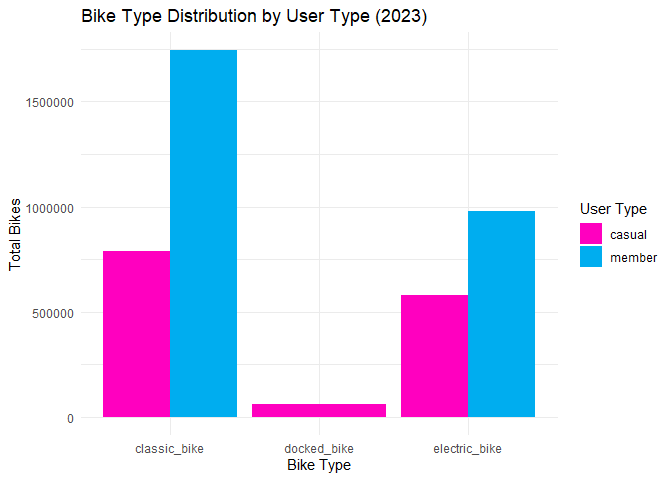<!-- -->

Analysis:

-   Cyclistic members never use docked bike.

-   Classic bike is the most popular bike for Cyclistic users.

-   Electric bike is the second choice bike if the classic bike not available at the bike station.


``` r
# Analyze how many rides by day of the week
cyclistic_day_of_week <- tripdata_2023_clean %>%
  group_by(member_casual, started_at_day_of_week) %>% 
  summarise(total_rides = n(), .groups = "drop")

day_of_week_bar_chart <- cyclistic_day_of_week %>% 
  ggplot(mapping = aes(x = started_at_day_of_week, y = total_rides, fill = member_casual)) +
  geom_col(position = "dodge") +
  labs(title = "Number of Rides by User Type During The Week (2023)", x = "Day of Week", y = "Total Rides", fill = "User Type") +
  theme_minimal() +
  scale_fill_manual(values = c("member" = "#00ADEF", "casual" = "#FF00BF"))

day_of_week_bar_chart
```

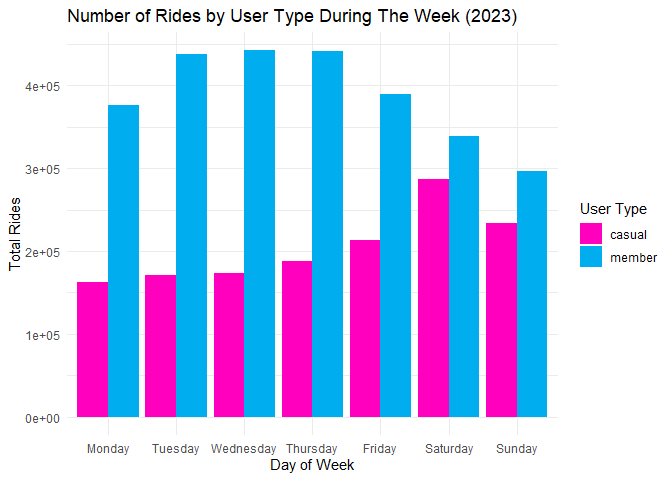<!-- -->

Analysis:

-   Cyclistic members mostly rides on Tuesday, Wednesday, and Thursday.

-   Cyclistic casual users mostly rides on Saturday.

-   The number of rides for Cyclistic members starts to increase from Monday, slowly decrease from Thursday and reach the lowest point on Sunday.

-   The number of rides for Cyclistic casual users starts to increase from Monday and starts to decrease on Sunday.

-   The lowest number of rides for Cyclistic casual users is on Monday.


``` r
# Analyze how many rides by month
cyclistic_months <- tripdata_2023_clean %>%
  group_by(member_casual, started_at_month) %>% 
  summarise(total_rides = n(), .groups = "drop")

months_bar_chart <- cyclistic_months %>% 
  ggplot(mapping = aes(x = started_at_month, y = total_rides, fill = member_casual)) +
  geom_col(position = "dodge") +
  labs(title = "Number of Rides by User Type During The Year (2023)", x = "Months", y = "Total Rides", fill = "User Type") +
  theme_minimal() +
  scale_fill_manual(values = c("member" = "#00ADEF", "casual" = "#FF00BF"))

months_bar_chart
```

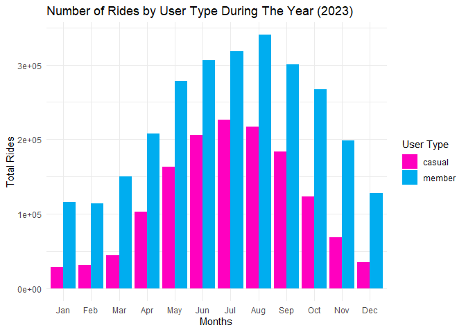<!-- -->

Analysis:

-   The highest number of rides for Cyclistic members during the year is on August.

-   The lowest number of rides for Cyclistic members during the year is on February.

-   The number of rides for Cyclistic members during the year starts to increase from January, peaks on August, and slowly decrease from September.

-   The highest number of rides for Cyclistic casual users during the year is on July.

-   The lowest number of rides for Cyclistic casual users during the year is on January.

-   The number of rides for Cyclistic casual users during the year starts to increase from January, peaks on July, and slowly decrease from August.

-   The number of rides during the year patterns follows a clear pattern of seasonality in Chicago where the highest number of rides is during Summer (July and August) and the lowest number of rides is during Winter (January).


``` r
# Analyze how many rides during the day
# Number of rides during the day by Cyclistic Members
cyclistic_member_departure_times <- tripdata_2023_clean %>%
  filter(member_casual == "member") %>% 
  group_by(started_at_time) %>% 
  summarise(total_rides = n())

member_departure_times_bar_chart <- cyclistic_member_departure_times %>% 
  ggplot(mapping = aes(x = started_at_time, y = total_rides)) +
  geom_bar(color = "#00ADEF", stat = "identity") +
  labs(title = "Number of Rides During The Day by Cyclistic Members (2023)", x = "Departure Times", y = "Total Rides") +
  scale_x_time(labels = function(x) format(x, "%H:%M"), breaks = breaks_width("3 hours")) +
  theme_minimal()

# Number of rides during the day by Cyclistic Casual Users
cyclistic_casual_departure_times <- tripdata_2023_clean %>%
  filter(member_casual == "casual") %>% 
  group_by(started_at_time) %>% 
  summarise(total_rides = n())

casual_departure_times_bar_chart <- cyclistic_casual_departure_times %>% 
  ggplot(mapping = aes(x = started_at_time, y = total_rides)) +
  geom_bar(color = "#FF00BF", stat = "identity") +
  labs(title = "Number of Rides During The Day by Cyclistic Casual Users (2023)", x = "Departure Times", y = "Total Rides") +
  scale_x_time(labels = function(x) format(x, "%H:%M"), breaks = breaks_width("3 hours")) +
  theme_minimal()

grid.arrange(member_departure_times_bar_chart, casual_departure_times_bar_chart, nrow = 2)
```

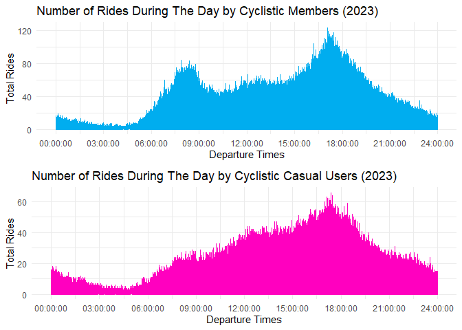<!-- -->

Analysis:

-   The number of rides by Cyclistic members starts to increase from 6:00 AM until 9:00 AM, slowly decrease until noon, and starts increasing again with most of rides is around 6:00 PM.

-   The number of rides by Cyclistic casual users starts to increase from 6:00 AM and reach peaks around 6:00 PM.


``` r
# Analyze average distance traveled and average ride length
average_distance_traveled <- cyclistic_users_type %>% 
  ggplot(mapping = aes(x = member_casual, y = ride_distance_mean, fill = member_casual)) +
  geom_bar(stat = "identity") +
  labs(title = "Average Distance Traveled by Cyclistic Users Type (2023)", x = "Users Type", y = "Average Distance Traveled (km)") +
  theme_minimal() +
  scale_fill_manual(values = c("member" = "#00ADEF", "casual" = "#FF00BF"))

average_ride_length <- cyclistic_users_type %>% 
  ggplot(mapping = aes(x = member_casual, y = as.numeric(ride_length_mean, units = "mins"), fill = member_casual)) +
  geom_bar(stat = "identity") +
  labs(title = "Average Ride Length by Cyclistic Users Type (2023)", x = "Users Type", y = "Average Ride Length (minute)") +
  theme_minimal() +
  scale_fill_manual(values = c("member" = "#00ADEF", "casual" = "#FF00BF"))

average_distance_traveled
```

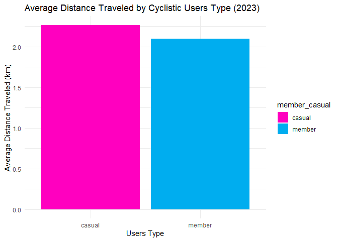<!-- -->

``` r
average_ride_length
```

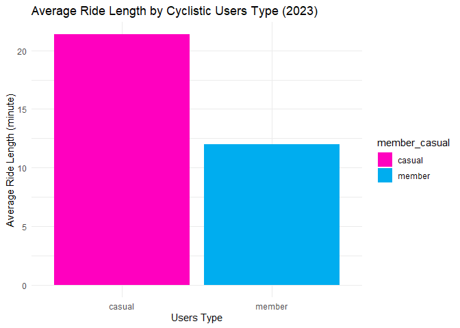<!-- -->

Analysis:

-   The average distance traveled by casual users and Cyclistic members is similar.

-   On average, casual users ride longer than Cyclistic members.


``` r
# Analyze the most popular bike station for arrival and departure
# Most Popular Bike Station for Arrival
cyclistic_arrival_stations <- tripdata_2023_clean %>%
  group_by(end_station_name) %>% 
  summarise(total_rides = n()) %>% 
  slice_max(order_by = total_rides, n = 10) %>% 
  mutate(end_station_name = reorder(end_station_name, total_rides))

arrival_bar_chart <- cyclistic_arrival_stations %>% 
  ggplot(mapping = aes(x = total_rides, y = end_station_name)) +
  geom_col(position = "dodge", fill = "#735FD9") +
  labs(title = "Top 10 Most Popular Bike Station for Arrival (2023)", x = "Total Rides", y = "Bike Station Names") +
  theme_minimal()

# Most Popular Bike Station for Arrival by Cyclistic Members
cyclistic_member_arrival_stations <- tripdata_2023_clean %>%
  filter(member_casual == "member") %>% 
  group_by(end_station_name) %>% 
  summarise(total_rides = n()) %>% 
  slice_max(order_by = total_rides, n = 10) %>% 
  mutate(end_station_name = reorder(end_station_name, total_rides))

member_arrival_bar_chart <- cyclistic_member_arrival_stations %>% 
  ggplot(mapping = aes(x = total_rides, y = end_station_name)) +
  geom_col(position = "dodge", fill = "#00ADEF") +
  labs(title = "Top 10 Most Popular Bike Station for Arrival by Cyclistic Member (2023)", x = "Total Rides", y = "Bike Station Names") +
  theme_minimal() +
  theme(plot.title = element_text(size = 10))

# Most Popular Bike Station for Arrival by Cyclistic Casual
cyclistic_casual_arrival_stations <- tripdata_2023_clean %>%
  filter(member_casual == "casual") %>% 
  group_by(end_station_name) %>% 
  summarise(total_rides = n()) %>% 
  slice_max(order_by = total_rides, n = 10) %>% 
  mutate(end_station_name = reorder(end_station_name, total_rides))

casual_arrival_bar_chart <- cyclistic_casual_arrival_stations %>% 
  ggplot(mapping = aes(x = total_rides, y = end_station_name)) +
  geom_col(position = "dodge", fill = "#FF00BF") +
  labs(title = "Top 10 Most Popular Bike Station for Arrival by Cyclistic Casual Users (2023)", x = "Total Rides", y = "Bike Station Names") +
  theme_minimal() +
  theme(plot.title = element_text(size = 8))

# Most Popular Bike Station for Departure
cyclistic_departure_stations <- tripdata_2023_clean %>%
  group_by(start_station_name) %>% 
  summarise(total_rides = n()) %>% 
  slice_max(order_by = total_rides, n = 10) %>% 
  mutate(start_station_name = reorder(start_station_name, total_rides))

departure_bar_chart <- cyclistic_departure_stations %>% 
  ggplot(mapping = aes(x = total_rides, y = start_station_name)) +
  geom_col(position = "dodge", fill = "#735FD9") +
  labs(title = "Top 10 Most Popular Bike Station for Departure (2023)", x = "Total Rides", y = "Bike Station Names") +
  theme_minimal() +
  theme(plot.title = element_text(size = 13))

# Most Popular Bike Station for Departure by Cyclistic Members
cyclistic_member_departure_stations <- tripdata_2023_clean %>%
  filter(member_casual == "member") %>% 
  group_by(start_station_name) %>% 
  summarise(total_rides = n()) %>% 
  slice_max(order_by = total_rides, n = 10) %>% 
  mutate(start_station_name = reorder(start_station_name, total_rides))

member_departure_bar_chart <- cyclistic_member_departure_stations %>% 
  ggplot(mapping = aes(x = total_rides, y = start_station_name)) +
  geom_col(position = "dodge", fill = "#00ADEF") +
  labs(title = "Top 10 Most Popular Bike Station for Departure by Cyclistic Member (2023)", x = "Total Rides", y = "Bike Station Names") +
  theme_minimal() +
  theme(plot.title = element_text(size = 10))

# Most Popular Bike Station for Departure by Cyclistic Casual
cyclistic_casual_departure_stations <- tripdata_2023_clean %>%
  filter(member_casual == "casual") %>% 
  group_by(start_station_name) %>% 
  summarise(total_rides = n()) %>% 
  slice_max(order_by = total_rides, n = 10) %>% 
  mutate(start_station_name = reorder(start_station_name, total_rides))

casual_departure_bar_chart <- cyclistic_casual_departure_stations %>% 
  ggplot(mapping = aes(x = total_rides, y = start_station_name)) +
  geom_col(position = "dodge", fill = "#FF00BF") +
  labs(title = "Top 10 Most Popular Bike Station for Departure by Cyclistic Casual Users (2023)", x = "Total Rides", y = "Bike Station Names") +
  theme_minimal() +
  theme(plot.title = element_text(size = 8))

# Show Diagrams
arrival_bar_chart
```

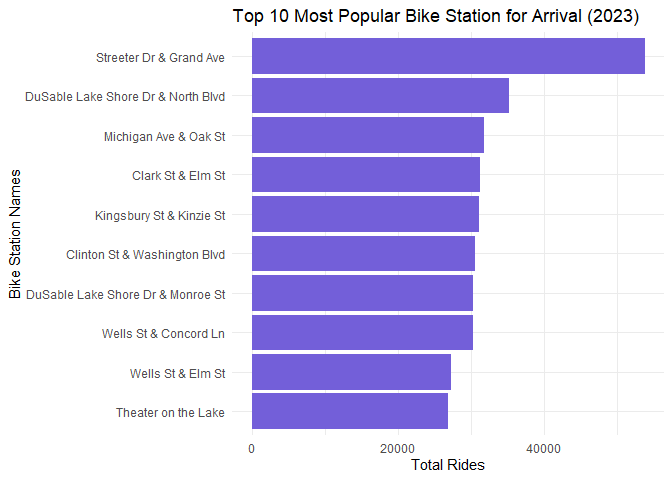<!-- -->

``` r
member_arrival_bar_chart
```

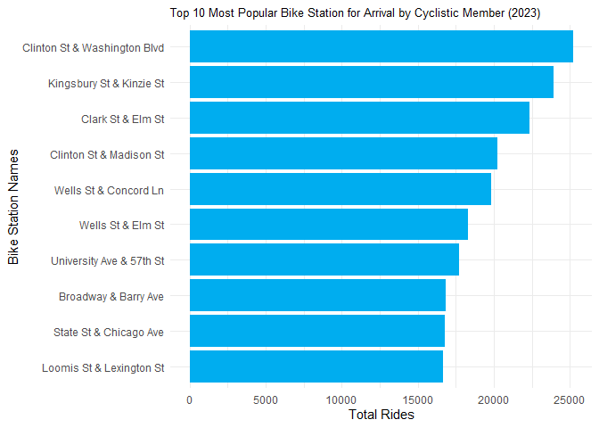<!-- -->

``` r
casual_arrival_bar_chart
```

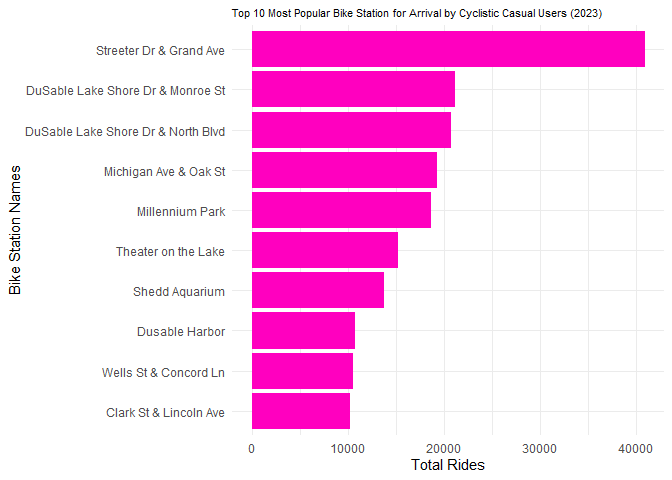<!-- -->

``` r
departure_bar_chart
```

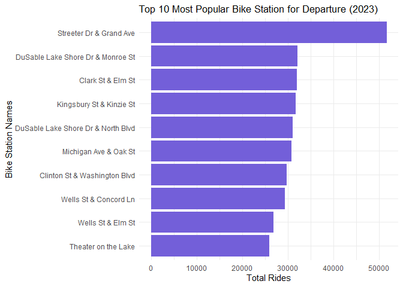<!-- -->

``` r
member_departure_bar_chart
```

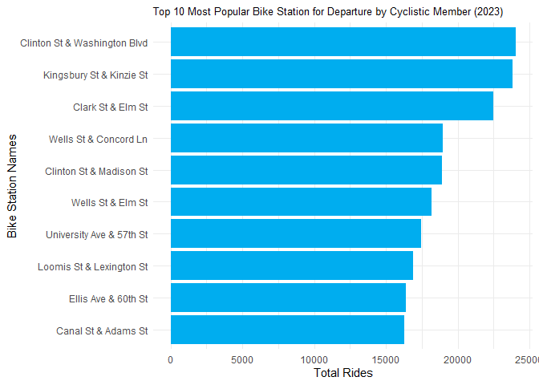<!-- -->

``` r
casual_departure_bar_chart
```

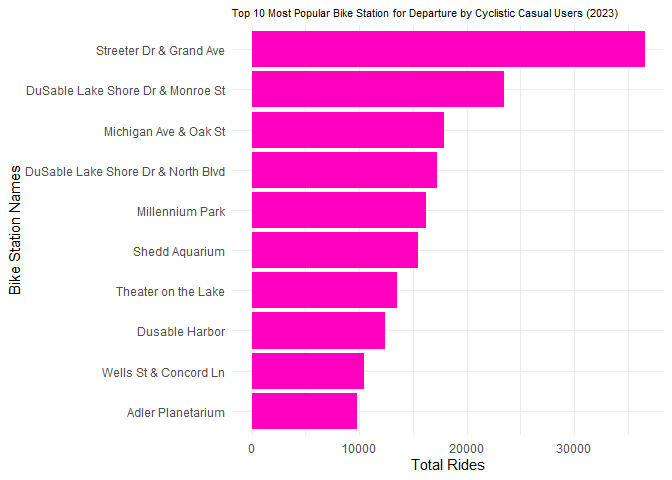<!-- -->

Analysis:

-   Streeter Dr & Grand Ave Bike Station is the most popular bike stations for arrival and departure reaching around 50.000 rides.

-   Streeter Dr & Grand Ave Bike Station also the most popular bike stations for arrival and departure by casual Cyclistic users.

-   Clinton St & Washington Blvd Bike Station is the most popular bike stations for arrival and departure by member of Cyclistic.


``` r
# Create bounding box and get Stadia Outdoors map of Chicago and Evanston
chi_ev_bb <- c(
  left = -87.750424,  
  bottom = 41.790769, 
  right = -87.574949, 
  top = 42.064536
)

chi_ev_map <- get_stadiamap(
  bbox = chi_ev_bb, zoom = 11, maptype = "stamen_toner"
)
```

```
## ℹ © Stadia Maps © Stamen Design © OpenMapTiles © OpenStreetMap contributors.
```

``` r
# Analyze Most Popular Routes by Cyclistic Users 
cyclistic_routes <- tripdata_2023_clean %>%
  group_by(start_lat, start_lng, end_lat, end_lng, member_casual, rideable_type) %>% 
  summarise(total_rides = n(), .groups = "drop") %>% 
  filter(total_rides > 250) %>%
  filter(
    between(start_lat, chi_ev_bb["bottom"], chi_ev_bb["top"]) &
    between(start_lng, chi_ev_bb["left"], chi_ev_bb["right"]) &
    between(end_lat, chi_ev_bb["bottom"], chi_ev_bb["top"]) &
    between(end_lng, chi_ev_bb["left"], chi_ev_bb["right"])
  )

popular_routes_by_user <- ggmap(chi_ev_map) +
  geom_curve(cyclistic_routes, mapping = aes(x = start_lng, y = start_lat, xend = end_lng, yend = end_lat, alpha = total_rides, color = member_casual), linewidth = 0.5, curvature = 0.2, arrow = arrow(length = unit(0.2,"cm"), ends = "first", type = "closed")) +
  coord_cartesian() +
  labs(title = "Most Popular Routes by Cyclistic Users", x = "Longitude", y = "Latitude", color= "User Type", alpha = "Total Rides") +
  scale_color_manual(values = c("member" = "#00ADEF", "casual" = "#FF00BF"))
```

```
## Coordinate system already present. Adding new coordinate system, which will
## replace the existing one.
```

``` r
# Analyze Most Popular Routes by Cyclistic Bike Type
popular_routes_by_bike_type <- ggmap(chi_ev_map) +
  geom_curve(cyclistic_routes, mapping = aes(x = start_lng, y = start_lat, xend = end_lng, yend = end_lat, alpha = total_rides, color = rideable_type), linewidth = 0.5, curvature = 0.2, arrow = arrow(length = unit(0.2,"cm"), ends = "first", type = "closed")) +
  coord_cartesian() +
  labs(title = "Most Popular Routes by Cyclistic Bike Type", x = "Longitude", y = "Latitude", color="Bike Type", alpha = "Total Rides")+
  scale_color_manual(values = c("classic_bike" = "#FF00BF", "docked_bike" = "#00ADEF"))
```

```
## Coordinate system already present. Adding new coordinate system, which will
## replace the existing one.
```

``` r
# Show visualization
popular_routes_by_user
```

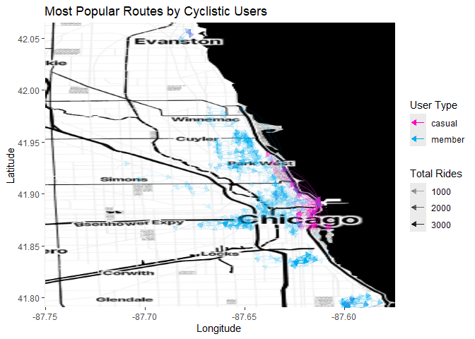<!-- -->

``` r
popular_routes_by_bike_type
```

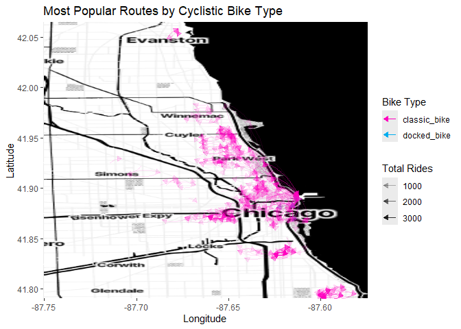<!-- -->

Analysis:

-   The most popular routes by Cyclistic casual users are centered around downtown of Chicago.

-   The most popular routes by Cyclistic members are spread across the cities of Chicago and Evanston.

-   Most Cyclistic users ride the most popular routes using classic bike.

-   Cyclistic members use Cyclistic for commuting purposes.

-   Cyclistic casual users use Cyclistic for recreational purposes.

# Phase 5: Share

After analyzing Cyclistic trip data in 2023, I've got a lot of interesting insight. Most of Cyclistic users feels the benefit for being a member of Cyclistic. This conclusion is based on fact that 65.6% of Cyclistic users are member of Cyclistic. It should be easy to get casual users to become Cyclistic members.

**Conclusions from my analysis:**

1.  How do annual members and regular riders use their bikes differently?
    -   Cyclistic members never ride with docked bike while casual users choose docked bike as the last choice if classic bike and electric bike not available in the bike stations. Cyclistic users prefer to use classic bike rather than electric bike and docked bike.

    -   Cyclistic members mostly rides during workday especially on Tuesday, Wednesday, and Thursday while casual users mostly rides during weekend especially on Saturday.

    -   In 2023, Cyclistic members mostly rides on August while casual users mostly rides on July. The number of rides during the year patterns follows a clear pattern of seasonality in Chicago where the highest number of rides is during Summer (July and August) and the lowest number of rides is during Winter (January).

    -   Cyclistic member often ride especially when going to work around 6:00 AM until 9:00 AM and when coming home from work around 6:00 PM. Cyclistic casual users usually starts ride from 6:00 AM and mostly rides around 6.00 PM.

    -   Cyclistic members and casual users ride with similar distance travelled but on average Cyclistic members ride for a short time of around 12 minutes while the average of casual users ride longer around 20 minutes.

    -   Cyclistic members mostly arrive and depart at Clinton St & Washington Blvd Bike Station while casual users mostly arrive and depart at Streeter Dr & Grand Ave Bike Station. Streeter Dr & Grand Ave Bike Station is ranked first in the most popular bike stations for arrivals and departures. Clinton St & Washington Blvd Bike Station is ranked sixth in the most popular bike stations for arrivals and ranked seventh in the most popular bike stations for departures.

    -   Cyclistic members mostly ride across the cities of Chicago and Evanston while casual users mostly ride at downtown of Chicago. Cyclistic members use Cyclistic for commuting purposes while casual users use Cyclistic for recreational purposes.
2.  Why do regular riders buy an annual Cyclistic membership?
    -   Casual users would love to convert into an annual Cyclistic member if they want to use Cyclistic for commuting purposes.

    -   Plans and pricing of bike usage for Cyclistic member is cheaper than casual users for long term.

    -   Casual users will buy a membership if they get a suitable price for longer bike use.
3.  How does Cyclistic use digital media to influence regular riders to become members?
    -   Cyclistic can create a marketing campaign to positioning Cyclistic as a bike-sharing apps for recreational and fun travelling.

    -   Cyclistic can offer a free trial to casual users for 2 weeks to make them consider to buy an annual Cyclistic membership.

    -   Create a discount offer around 6:00 PM for casual users.

    -   Create summer campaign for casual users especially on July.

    -   Offer casual users a discount if they ride for more than 20 minutes.

    -   Add a voucher codes for discount at most popular bike stations by casual users like Streeter Dr & Grand Ave Bike Station, DuSable Lake Shore Dr & North Blvd Bike Station, Michigan Ave & Oak St Bike Station, and DuSable Lake Shore Dr & Monroe St Bike Station.
4.  Additional advice for Cyclistic apps
    -   Try to make a fixed coordinates for every bike stations so it would be easier to analyze.

    -   Add more electric bikes at Top 3 most popular bike stations for arrivals and departures.

    -   Create electric bikes promotional offers to increase the number of usage for electric bikes also increase Cyclistic users.
